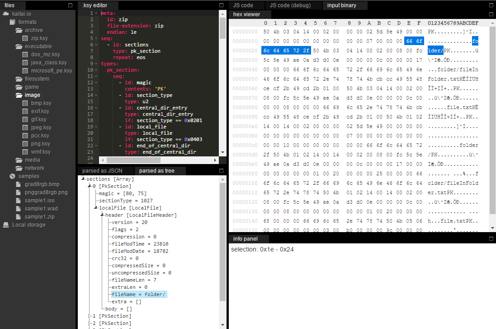
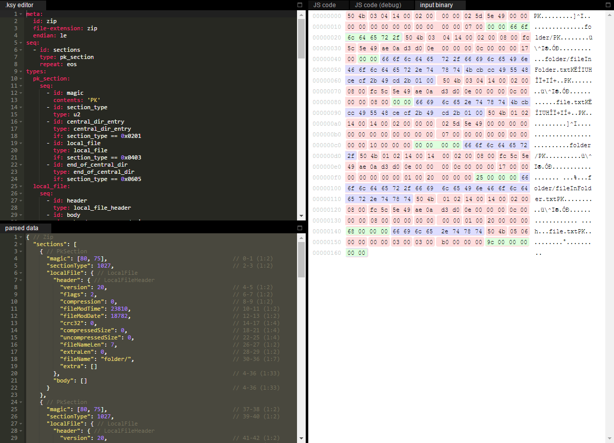

# Kaitai Struct WebIDE

Online editor / visualizer for Kaitai Struct .ksy files

## features

[See the Features wiki page](https://github.com/kaitai-io/kaitai_struct_webide/wiki/Features)

## community

[Visit us on Gitter](https://gitter.im/kaitai_struct/Lobby)

## demo

[ide.kaitai.io](https://ide.kaitai.io/)

## run locally (without compiling / modifying the source code)

- Clone deploy version: `git clone https://github.com/kaitai-io/ide-kaitai-io.github.io`
    - stable release: `/`, devel release: `/devel/`,
- Serve on a webserver (e.g. `python3 -m http.server 8000`)
- Go to [http://localhost:8000/](http://localhost:8000/)

## compile and run locally

- `git clone --recursive https://github.com/kaitai-io/kaitai_struct_webide`
- `npm install`
- `node serve.js --compile`
- Go to [http://127.0.0.1:8000/](http://127.0.0.1:8000/)

## screenshots

For more screenshots [visit the Features wiki page](https://github.com/kaitai-io/kaitai_struct_webide/wiki/Features)
