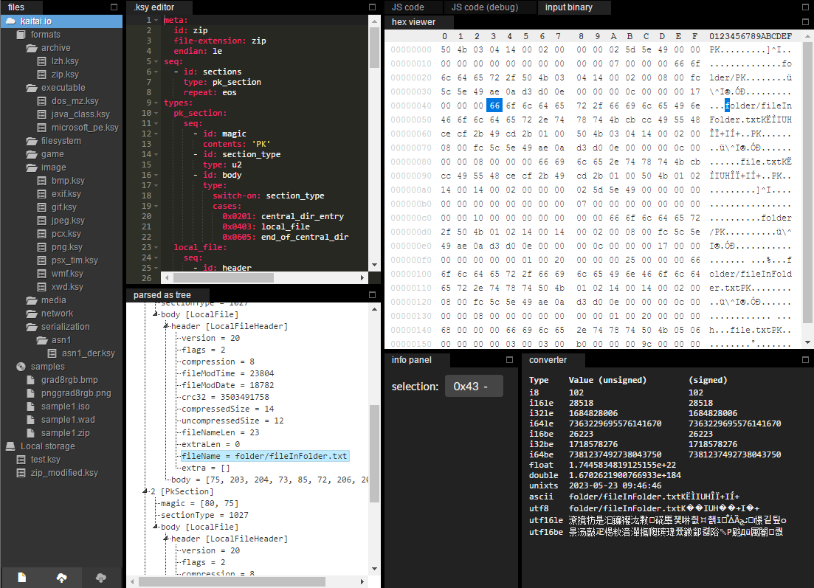

# Kaitai Struct WebIDE

Online editor / visualizer for Kaitai Struct .ksy files

## features

[See the Features wiki page](https://github.com/kaitai-io/kaitai_struct_webide/wiki/Features)

## community

[Visit us on Gitter](https://gitter.im/kaitai_struct/Lobby)

## demo

[kaitai.lorthiz.ovh](https://kaitai.lorthiz.ovh/)

## compile and run locally

- `git clone --recursive https://github.com/kaitai-io/kaitai_struct_webide`
- `npm install`
- `npm run generate-formats`
- `npm run parcel-run`
- Go to [http://127.0.0.1:8000/](http://127.0.0.1:8000/)

## screenshots

For more screenshots [visit the Features wiki page](https://github.com/kaitai-io/kaitai_struct_webide/wiki/Features)
